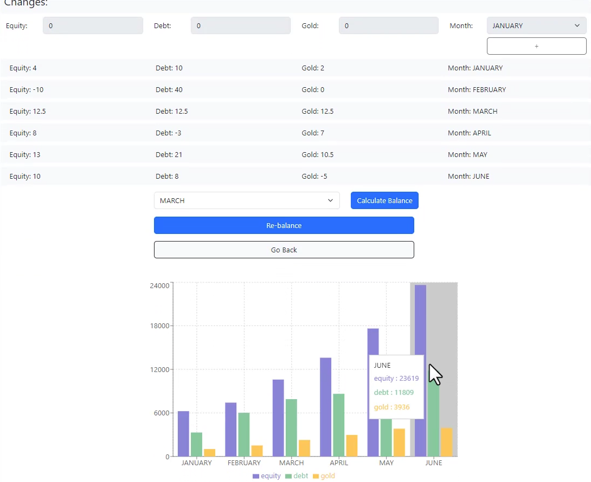
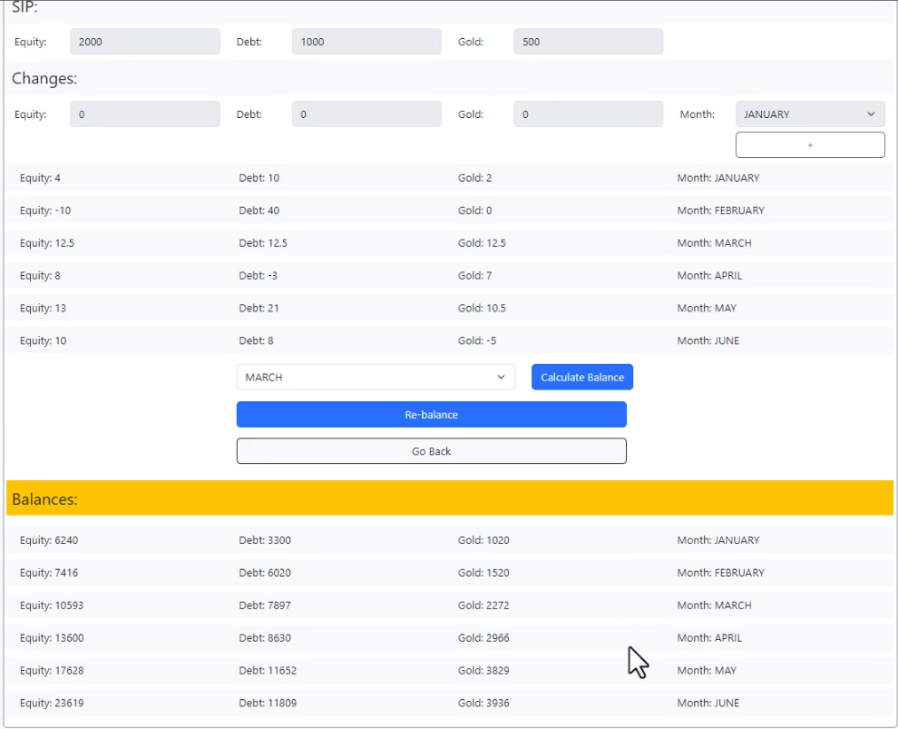

My Money Project:

- User can define allocation, sip and change rates or upload a file in defined format
- Can see the balance of each month
- Can re-balance, if change rates of June and December exists
- Can see the balances in a bar chart

Sample Video: https://github.com/alinasir85/mymoney/blob/master/MyMoney.mp4

Live Site: https://alinasir85.github.io/mymoney/

